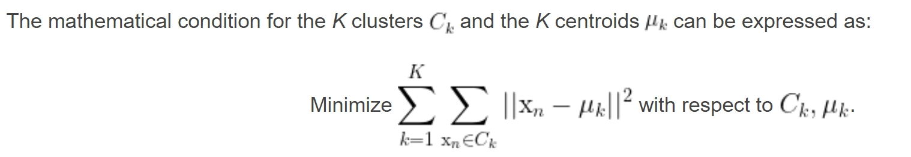
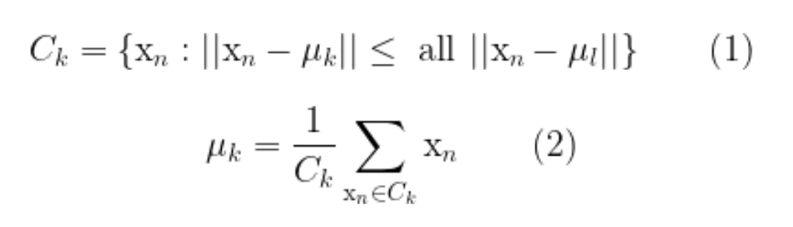

# Clustering with k-means

<br>

> A very common task in data analysis is that of grouping a set of objects into subsets such that all elements within a group are more similar among them than they are to the others. The practical applications of such a procedure are many: given a medical image of a group of cells, a clustering algorithm could aid in identifying the centers of the cells; looking at the GPS data of a user’s mobile device, their more frequently visited locations within a certain radius can be revealed; for any set of unlabeled observations, clustering helps establish the existence of some sort of structure that might indicate that the data is separable.

<br>

>Uma tarefa bastante comum em análise de dados é a de agrupar conjuntos de objetos em subconjuntos, tais que todos os seus elementos são mais semelhantes entre si do que com os elementos dos outros grupos.
> <br> As aplicações práticas deste processo são várias:
> - dada uma imagem médica de um grupo de células, um algoritmo de **clustering** pode ajudar a identificar os centros dessas células
>- atentando a informação do GPS do dispositivo de um utilizador, as localidades mais frequentemente visitadas, num determinado raio, podem ser reveladas
>- para cada conjunto de observações não categorizadas, **clustering** ajuda a estabelecer a existência de algum tipo de estrutura que poderá indicar que a informação nelas contida é separável

<br>

---

<br>


## Mathematical background

<br>

> The k-means algorithm takes a dataset X of N points as input, together with a parameter K specifying how many clusters to create. The output is a set of K cluster centroids and a labeling of X that assigns each of the points in X to a unique cluster. All points within a cluster are closer in distance to their centroid than they are to any other centroid.

> O algoritmo de **clustering** **K-MEANS** recebe um dataset, X, de N pontos como input, juntamente com um parâmetro, **K**, especificando quantos clusters se devem criar.
> <br> O output é um conjunto de **K** "cluster centroids" e uma categorização de X que relaciona cada ponto de X a um único cluster.
> <br> Todos os pontos de um cluster estão mais próximos, em distância, do seu centroide do que estão de qualquer outro centroide.

<br>



<br>

---

<br>

## Lloyd’s algorithm

<br>

> Finding the solution is unfortunately NP hard. Nevertheless, an iterative method known as Lloyd’s algorithm exists that converges (albeit to a local minimum) in few steps. The procedure alternates between two operations. (1) Once a set of centroids \mu_k is available, the clusters are updated to contain the points closest in distance to each centroid. (2) Given a set of clusters, the centroids are recalculated as the means of all points belonging to a cluster.

Infelizmente, encontrar uma solução para este problema é considerado um problema **NP HARD**.

<br>

---


### NP Hard problem

> In computational complexity theory, NP-hardness (non-deterministic polynomial-time hardness) is the defining property of a class of problems that are informally "at least as hard as the hardest problems in NP". A simple example of an NP-hard problem is the subset sum problem.

> Pela teoria de complexidade computacional, **NP-hardness** (non-deterministic polynomial-time hardness) é a definição da propriedade de uma classe de problemas que são, informalmente, "no mínimo tão difíceis quanto os problemas mais difíceis em **NP**". Um exemplo simples de um problema **NP-HARD** é o problema do somatório de subconjuntos.
> <br><br> De maneira resumida, não se consegue encontrar uma solução que resolva o problema em tempo polinomial

---

<br>

> Não obstante, há um **método iterativo** conhecido como **algoritmo de Lloyd** que converge em relativamente poucos passos. O procedimento altera entre 2 operações:
> - 1) Assim que um conjunto de centroides, U_k, está disponível, os clusters são atualizados para conter os pontos mais perto, em distância, de cada centroide
> <br>
> - 2) Dado um conjunto de clusters, os centroides são recalculados como a média de todos os pontos pertencentes ao cluster.
> <br>

<br>



<br>

> The two-step procedure continues until the assignments of clusters and centroids no longer change. As already mentioned, the convergence is guaranteed but the solution might be a local minimum. In practice, the algorithm is run multiple times and averaged. For the starting set of centroids, several methods can be employed, for instance random assignation.

<br>

> O procedimento de 2 passos continua até que as atribuições de clusters e centroides já não se alterem. Como já foi mencionado, a **convergência é garantida**, **mas a solução pode ser um mínimo local**.
> <br> Na prática, o algoritmo é corrido múltiplas vezes e feita uma média. Para o conjunto inicial de centroides, podem ser empregues inúmeros métodos como, por exemplo, **random assignation**. 

<br>

---

<br>

> Below is a simple implementation of Lloyd’s algorithm for performing k-means clustering in python:

<br>

```python
import numpy as np
 
def cluster_points(X, mu):
    clusters  = {}
    for x in X:
        bestmukey = min([(i[0], np.linalg.norm(x-mu[i[0]])) \
                    for i in enumerate(mu)], key=lambda t:t[1])[0]
        try:
            clusters[bestmukey].append(x)
        except KeyError:
            clusters[bestmukey] = [x]
    return clusters
 
def reevaluate_centers(mu, clusters):
    newmu = []
    keys = sorted(clusters.keys())
    for k in keys:
        newmu.append(np.mean(clusters[k], axis = 0))
    return newmu
 
def has_converged(mu, oldmu):
    return (set([tuple(a) for a in mu]) == set([tuple(a) for a in oldmu])
 
def find_centers(X, K):
    # Initialize to K random centers
    oldmu = random.sample(X, K)
    mu = random.sample(X, K)
    while not has_converged(mu, oldmu):
        oldmu = mu
        # Assign all points in X to clusters
        clusters = cluster_points(X, mu)
        # Reevaluate centers
        mu = reevaluate_centers(oldmu, clusters)
    return(mu, clusters)

```